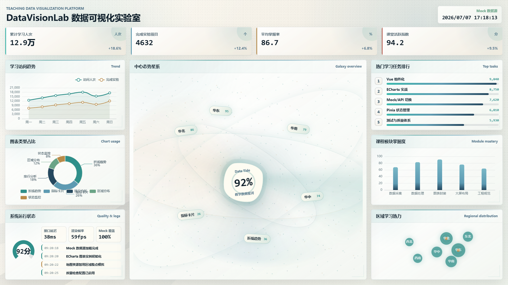

# DataVisionLab

数据可视化实验室，一个面向学生的数据大屏入门实践项目。

## 效果预览



## 动态交互

- 普通指标卡和图表容器支持统一 Q 弹悬浮反馈。
- 中心主视觉区域为“学习访问与实验完成趋势”，悬浮时会柔和放大并产生云雾扩散和空间聚焦效果。
- 周围信息面板在中心主框聚焦时会轻微弱化，突出主图表阅读层级。
- 已适配 `prefers-reduced-motion`，系统开启减少动态效果时会自动降低动画强度。
- 本地运行后将鼠标悬浮到指标卡、图表面板和中心趋势图，即可预览动效。

## 项目定位

DataVisionLab 用于帮助学生从 0 到 1 学习并实现一个数据可视化大屏项目。项目将围绕数据采集、数据处理、图表设计、大屏布局和前端展示等核心环节逐步展开，适合教学演示、课程实训和个人练习。

## 技术栈

- Vue 3 + Vite + TypeScript
- Vue Router + Pinia
- ECharts + Axios
- Mock 数据层，后续可切换真实 API
- Vitest + Playwright
- ESLint + Prettier + Stylelint

## 快速开始

```bash
npm install
npm run dev
```

默认访问地址：

```txt
http://127.0.0.1:5173
```

## 常用命令

```bash
npm run build
npm run test
npm run test:e2e
npm run lint
npm run lint:style
npm run format
```

## 数据源切换

当前默认使用 mock 数据：

```txt
VITE_DATA_SOURCE=mock
```

后期接入真实 API 时可切换为：

```txt
VITE_DATA_SOURCE=api
VITE_API_BASE_URL=/api
```

## 计划方向

- 搭建数据可视化大屏基础工程
- 设计适合教学场景的数据指标与展示模块
- 实现常见图表、地图、排行、趋势和统计卡片
- 沉淀从需求分析到上线展示的完整实践流程

## 开源协议

本项目使用 MIT License 开源协议。
